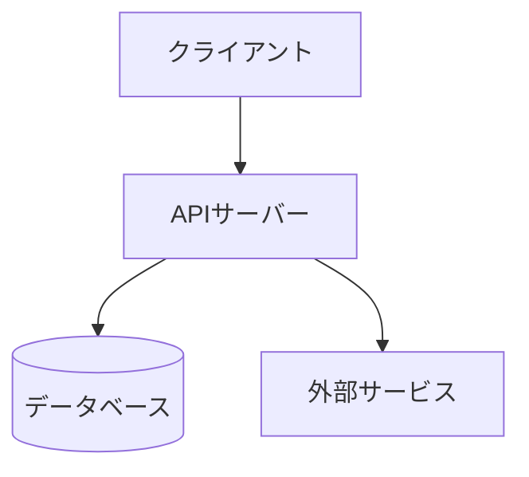
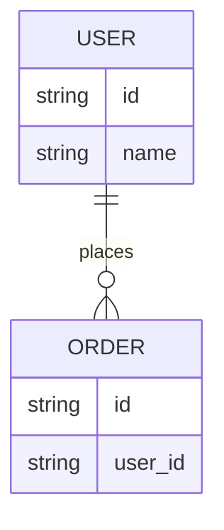

# 基本設計書

案件名・対象システム名は着手時に記入する。本書は雛形であり、内容は空欄のまま使わない。

## 構成図

> システム全体のコンポーネント構成をMermaidで書く。クライアント・API・DB・外部サービスの接続関係を含める。

## ER図

> 主要エンティティと関連をMermaidで書く。カラム定義は詳細設計書に委ね、ここではキーと関連のみ書く。

## 認証・権限方式

> 認証方式(例: OIDC/セッション/APIキー)と権限モデル(例: RBAC)を具体名で書く。

## インフラ構成

> 実行環境(例: Vercel/AWS ECS)とマネージドサービスの利用範囲を書く。自前運用が必要な部分は理由も添える。

## 外部連携

> 連携先サービス名、通信方式(REST/Webhook等)、認証方式を一覧で書く。
